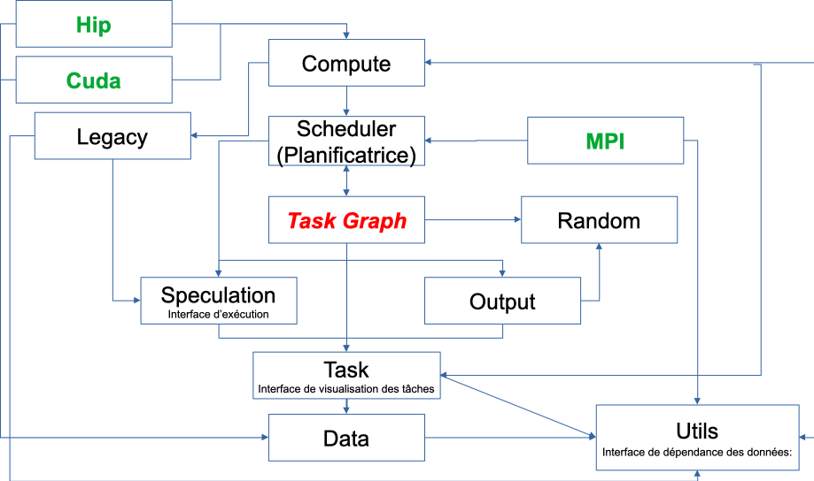

=== 4.Specx

*SPECX* is a task-based execution system. It shares many similarities
with StarPU but is written in modern C++. It also supports speculative
execution, which is the ability to run tasks ahead of time if others are
unsure about changing the data.

*4.1 Workflow*

* *Execution interface:* Provides functionality for creating tasks, task
graphs and generating traces. Can be used to specify speculation model
* *Data Dependency Interface:* Forms a collection of objects that can be
used to express data dependencies. Also provides wrapper objects that
can be used to specify whether a given callable should be considered CPU
or GPU code
* *Task visualization interface:* Specifies the ways to interact with
the task object.

*4.1.1 Runtime interface*

Runtime functionality is exposed through a class called SpRuntime . This
class provides functionality for creating tasks, task graphs, and
generating traces.

The SpRuntime class is modeled on a non-type parameter which can be used
to specify the speculation model you want to use. This parameter can
take one of three values (we currently support three different
speculation models) defined in [.underline]#SpSpeculativeModel.hpp# . By
default, the runtime uses the first speculation model.

*Main SpRuntime methods:* SpRuntime(const inNumThreads)

Currently, each instance of SpRuntime has its own thread pool to
distribute its work on. *In the future, we plan to separate thread
management from execution.* The runtime constructor takes as a parameter
the number of threads it must spawn. By default , the parameter is
initialized to the number indicated by the OMP_NUM_THREADS environment
variable. If the environment variable is not set, the setting defaults
to the number of concurrent threads supported by the hardware. The
constructor spawns the new threads. *At this time, we do not allow
manual binding of threads to cores.*

For now, the runtime will bind threads to cores by thread index if the
OMP_PROC_BIND environment variable is set to TRUE (or true or 1 ) or if
inNumThreads is less than or equal to the number of concurrent threads
supported by the material.

autotask([optional] SpPriority inPriority, [optional] SpProbability
inProbability, [optional] <DataDependencyTy> ddo..., <CallableTy> c) (1)

autotask([optional] SpPriority inPriority, [optional] SpProbability
inProbability, [optional] <DataDependencyTy> ddo...,
SpCpuCode(<CallableTy> c1), [optional] SpGpuCode(<CallableTy> c2)) (2)

This method creates a new task and injects it into the runtime. It
returns an object representing the newly created task.

*inPriority* parameter specifies a priority for the task.

*inProbability* parameter is an object used to specify the probability
with which the task can write to its writeable data dependencies.

After the inProbability parameter is a list of data dependency objects.
This list declares the task's data dependencies. *At this time we only
allow one type of data dependency to be declared for a given data item
and a data dependency declaration of a certain type for a particular
data item should only appear once times, except for atomic read and
write dependencies.*

For example, you cannot have a read and write dependency for the same
data item (in this case, you should only declare the strongest type of
dependency which is write). The validity of dependencies is checked at
runtime. If you declared two data dependencies on different expressions
but evaluated on the same data item, the program will exit.

The last or two last arguments (depending on which overload the call
resolves to) specifies (a) callable(s) embedding the code the task
should execute. Callables can be lambda expressions or functors. The
callable's function call operator must have as many parameters as there
are data dependency objects in the data dependency object list. All
parameters must be of lvalue reference type, and the type of each
parameter must be the same as the data item of the corresponding data
dependency object in the data dependency object list (you can also type
infer the type with auto). Parameters must appear in the same order as
they appear in the data dependency list.

    Example:
    
    Type1 v1;
    Type2 v2;
    runtime. task ( SpRead(v1), SpWrite(v2),
    [] (const Type1 &paramV1, Type2 &paramV2) {
    if(paramV1.test()) { paramV2.set(1); } else { paramV2.set(2);} }
    );

Parameters corresponding to an SpRead data dependency object must be
declared const (paramV1 in the example given above). The code inside the
callable should refer to the parameter names rather than the original
variable names. In the example given above, the code in the lambda body
references the names paramV1 and paramV2 to refer to the data values v1
and v2 rather than v1 and v2. You should not capture v1 and v2 by
reference and work with v1 and v2 directly. However, you can capture any
variable that does not appear in the data dependency list and work with
it directly. The runtime will store the addresses of the data items
appearing in the data dependency list and take care of calling the
callable with the appropriate matching arguments. In the example given
above, assuming the task call is the only task call in the entire
program, the runtime will take the addresses of v1 and v2 (since those
are the data items that appear in the data dependency list) and when the
task runs it will call the lambda with the arguments *v1 and *v2. Note
that since Specx is a speculative task-based runtime system, there will
also be times when the callable is called with copies of the data items
(sampled at different times) rather than the original data items.

Callables for normal tasks can return any value. Callables for potential
tasks must all return a boolean, however. This boolean is used to inform
the runtime whether the task has written to its data dependencies may
write or not. The callable's code should correctly return true or false
depending on the situation. It should return true if the task has
written to its data dependencies maybe write and false otherwise.

In overload (1), the callable is passed as is to the task call. It will
be implicitly interpreted by the runtime as CPU code. In overload (2),
the callable c1 is explicitly labeled as CPU code by being wrapped in an
SpCpuCode object (see the subsection on callable wrapper objects in the
Data Dependency Interface section below). Overload (2) further allows
the user to provide a GPU version of the code (in this case the callable
must be wrapped in an SpGpuCode object). When the CPU and GPU versions
of the code are provided, the Specx runtime will decide at runtime which
of the two to run.

void setSpeculationTest(std::function<bool(int,const SpProbability&)>
inFormula)

This method defines a predicate function that will be called by the
runtime whenever a speculative task is ready to be placed in the task
ready queue (i.e. all its data dependencies are ready ). The predicate
is used to decide, based on runtime information, whether the speculative
task as well as any of its dependent speculative tasks should be allowed
to run. The predicate returns a boolean. A return value of true means
that the speculative task and all of its dependent speculative tasks are
allowed to run. Conversely, a return value of false means that the
speculative task and all of its dependent speculative tasks should be
disabled.

Note that although a speculative task may be allowed to run, this does
not necessarily mean that it will actually run. For a speculative task
to actually execute all of the parent speculations it speculates on,
they must not have failed. It may be that between the time the
speculative task has been marked as allowed to run and the time it is
actually picked up by a thread for execution, some of the parent
speculations have failed and therefore it will not be executed even
though it was allowed to run depending on the result of the predicate
evaluation in the past.

The two predicate arguments are provided by the runtime. The first
parameter is the number of tasks that were in the ready queue when the
predicate was called. The second parameter is a probability whose value
is the average of all probabilities of all speculative tasks dependent
on the speculative task for which the predicate is called and the
probability of the speculative task for which the predicate is called.
Based on these two parameters, one can write his own custom logic to
enable/disable speculative tasks. For example, you can decide to
deactivate a speculative task if the average probability exceeds a
certain threshold (because it may not make much sense to continue
speculating if the chances of failure are high). *The prototype of the
predicate might change in the future as we might want to consider
additional or different data to make the decision.*

If no speculation test is defined in the runtime, the default behavior
is that a speculative task and all its dependent speculative tasks will
only be activated if, at the time the predicate is called, no other task
is ready to run.

void waitAllTasks()

This method is a blocking call that waits for all tasks that have been
pushed to run up to this point to complete.

void waitRemain(const long int windowSize)

This method is a blocking call that waits for the number of unprocessed
tasks to become less than or equal to windowSize.

void stopAllThreads()

This method is a blocking call that causes execution threads to close.
The method expects all tasks to have already completed, so you should
always call waitAllTasks() before calling this method.

int getNbThreads()

This method returns the size of the execution thread pool (in number of
threads).

void generateDot(const std::string& outputFilename, bool printAccesses)

This method will generate the task graph corresponding to the execution
in point format. It will write its output to the outputFilename path.
The boolean printAccesses can be set to true if you want to print the
tasks memory accesses (only the memory accesses specified in their data
dependency list will be printed) in the tasks node body. By default,
printAccesses is set to false.

The names of the tasks will be printed in the nodes of the graph. The
default name will be displayed for each task unless another name has
been manually defined by the user (see Task Viewer Interface section
below). Speculative versions of tasks will have an apostrophe appended
to their name. You can view the task graph in pdf format using the
following command:

dot -Tpdf -o <pdf_output_filename> <path_to_dot_output_file>

The generateDot method should be called after calling waitAllTasks() and
stopAllThreads().

void generateTrace(const std::string& outputFilename, const bool
showDependencies)

This method will generate a trace of the execution (with timings and
dependencies) in svg format. The generateTrace method should only be
called after calling waitAllTasks() and stopAllThreads().

*4.1.2 Data dependency interface*

The data dependency interface forms a collection of objects that can be
used to express data dependencies. It also provides wrapper objects that
can be used to specify whether a given callable should be considered CPU
or GPU code. The class definition for these objects is in
[.underline]#Src/Utils/SpModes.hpp# .

*Data dependency objects*

Specifying data dependencies amounts to constructing the relevant data
dependency objects from the data lvalues.

*Scalar data*

S pRead(x) // Specifies a read dependency on x. Read requests are always
satisfied by default, i.e. a read request rr2 on data x immediately
following another read request rr1 on data x need not wait until rr1 be
satisfied to be served. Several successive read accesses will be
performed in any order and/or at the same time. Reads are ordered by the
runtime with respect to writes, maybe writes, commutative writes, and
atomic writes. The order is the order in which data accesses were
requested at runtime.

SpWrite(x) // Specifies a write dependency on x indicating that data x
will be written with 100% certainty. Several successive write requests
on given data x will be satisfied one after the other in the order in
which they were issued during execution. Writes are categorized by the
runtime into reads, writes, maybe writes, commutative writes, and atomic
writes. The order is the order in which data accesses were requested at
runtime.

SpMaybeWrite(x) // Specifies a possibly writeable dependency indicating
that data x can be written, i.e. it will not always be the case (writes
can occur with some probability). Several possibly successive write
requests on given data x will be satisfied one after the other in the
order in which they were issued at runtime. Maybe writes are categorized
by the runtime into reads, writes, maybe writes, commutative writes, and
atomic writes. The order is the order in which data accesses were
requested at runtime.

SpCommutativeWrite(x) // Specifies a commutative write dependency on x,
ie writes that can be performed in any order. Several successive
commutative write requests will be satisfied one after the other in any
order: while a commutative write request cw1 on data x is currently
being processed, all immediately following commutative write requests on
data x given x will be put on hold. When cw1 is released, one of the
immediately following commutative write requests will be serviced. No
order is applied by the runtime as to which one will be served next. For
example, if two commutative tasks write to data x, the runtime does not
impose an order as to which tasks should write first. However, the two
tasks will not be able to run in parallel: while one of the two tasks is
running and writing to data x, the other task will not be able to run
because its write dependency request commutative will not be processed
until the first task has finished executing and has released its
commutative write dependency on x. Commutative writes are classified by
the runtime into reads, writes, maybe writes, and atomic writes. The
order is the order in which data accesses were requested at runtime.

SpAtomicWrite(x) // Specifies an atomic write dependency on x. Atomic
write requests are always satisfied by default, i.e. an awr2 atomic
write request on data x immediately following another awr1 atomic write
request on data x does not have need to wait for awr1 to be satisfied to
be served. Several successive atomic writes will be performed in any
order. For example, if two tasks write atomically to the data x, the
runtime does not impose an order as to which tasks should write
atomically first and the two tasks can run in parallel. Atomic writes
will be committed to memory in the order in which they will be committed
at runtime, the point is that the Specx runtime does not impose an order
on atomic writes. Atomic writes are classified by the runtime into
reads, writes, maybe writes, and commutative writes. The order is the
order in which data accesses were requested at runtime. All data
dependency constructors for scalar data must receive an lvalue as an
argument.

*Non-scalar data*

We also provide analogous constructors for aggregating data values from
arrays:

    SpReadArray(<XTy> *x, <ViewTy> view)
    
    SpWriteArray(<XTy> *x, view<ViewTy>)
    
    SpMaybeWriteArray(<XTy> *x, <ViewTy> view)
    
    SpCommutativeWriteArray(<XTy> *x, view<ViewTy>)
    
    SpAtomicWriteArray(<XTy> *x, view <ViewTy>)

x must be a pointer to a contiguous buffer (the array).

view must be an object representing the collection of specific indices
of array elements that are affected by the dependency. It must be
iterable (in the "stl iterable" sense). An example implementation of
such a view class can be found in
[.underline]#Src/Utils/SpArrayView.hpp# .

*Wrapper objects for callables*

We provide two wrapper objects for callables whose purpose is to mark up
a callable to inform the runtime system whether to interpret the given
callable as CPU or GPU code:

    SpCpuCode(<CallableTy> c)

Specifies that the callable c represents CPU code.

    SpGpuCode(<CallableTy> c)

Specifies that the callable c represents GPU code.

In both cases, the callable c can be a lambda or an lvalue or rvalue
functor.

A callable that appears as an argument to a call to the task method of
an SpRuntime object without being wrapped in one of the above two
objects will be interpreted by the runtime as CPU code by default.

*4.1.3 Task visualization interface*

The Task Viewer interface specifies ways to interact with the task
object returned by SpRuntime's task method. The exact type returned by
SpRuntime's task method doesn't matter and in practice it should be
inferred from the (auto) type in your programs. You can, however, find
the definition of the returned type in
[.underline]#Src/Tasks/SpAbstractTask.hpp# .

*Main methods available on task objects returned by task calls*

    bool isOver() // Returns true if the task has finished executing.
    
    Void wait() //This method is a blocking call that waits for the task to
    complete.

    <ReturnType> getValue() // This method is a blocking call that retrieves
    the task's result value (if it has any). It first waits for the task to
    complete and then retrieves the result value.
    
    void setTaskName(const std::string& inTaskName) // Assign the name
    inTaskName to the task. This change will be reflected in debug
    printouts, task graph, and trace generation output. By default, the task
    will be named as the dismembered string of the typeid name of the task's
    callable.

std::string getTaskName() // Get the task name. *Speculative versions of
tasks will have an apostrophe appended to their name.*

*GPU/CUDA (work in progress)*

The CMake variable SPECX_COMPILE_WITH_CUDA must be set to ON, for
example with the command cmake .. -DSPECX_COMPILE_WITH_CUDA=ON . If
CMake is unable to find nvcc, set the CUDACXX environment variable or
the CMake variable CMAKE_CUDA_COMPILER to the path to nvcc. You can
define CMAKE_CUDA_ARCHITECTURES to select the CUDA sm to compile.

Here is an example job on CUDA GPU:

    tg.task(SpWrite(a),// Dependencies are expressed as usual
    
    SpCuda( { // Each
    parameter is converted into a SpDeviceDataView
    
    // The kernel call is called using the dedicated stream
    
    inc_var<<<1,1,0,SpCudaUtils::GetCurrentStream()>>>(paramA.array(),
    
    paramA.nbElements());
    
    })
    
    );

Currently, the call to a CUDA kernel must be done in a .cu file. There
are three types of SpDeviceDataView that provide different methods: one
for is_trivially_copyable objects, one for std::vectors of
is_trivially_copyable objects, and one user-customized. At the latest,
it is requested to provide the following methods:

    std::size_t memmovNeededSize() const{
    
    ...
    
    }
    
    pattern <DeviceMemmov class>
    
    void memmovHostToDevice(DeviceMemmov& mover, void* devicePtr,
    std::size_t size){
    ...
    
    }
    
    pattern <DeviceMemmov class>
    
    void memmovDeviceToHost(DeviceMemmov& mover, void* devicePtr,
    std::size_t size){
    ...
    
    }
    
    self getDeviceDataDescription() const{
    ...
    
    }

The type returned by getDeviceDataDescription must be copyable and have
an empty constructor. It should be used to help retrieve raw pointer
data when calling a device kernel.

*GPU/HIP (work in progress)*

The CMake variable SPECX_COMPILE_WITH_HIP must be set to ON, for example
with the command cmake .. -DSPECX_COMPILE_WITH_HIP=ON . The C++ compiler
must also be defined with for example CXX=hipcc , so a working command
line must be CXX=hipcc cmake .. -DSPECX_COMPILE_WITH_HIP=ON . You can
set GPU_TARGETS to select the HIP sm to compile.

Here is an example of a task on a HIP GPU:
    
    tg.task(SpWrite(a),// Dependencies are expressed as usual
    
    SpHip( { // Each parameter
    is converted into a SpDeviceDataView
    
    // The kernel call is called using the dedicated stream
    
    inc_var<<<1,1,0,SpHipUtils::GetCurrentStream()>>>(paramA.array(),
    
    paramA.nbElements());
    
    })
    
    );

Currently, the call to a HIP kernel must be done in a .cu file. There
are three types of SpDeviceDataView that provide different methods: one
for is_trivially_copyable objects, one for std::vectors of
is_trivially_copyable objects, and one user-customized. At the latest,
it is requested to provide the following methods:
    
    std::size_t memmovNeededSize() const{
    
    ...
    
    }
    
    pattern <DeviceMemmov class>
    
    void memmovHostToDevice(DeviceMemmov& mover, void* devicePtr,
    std::size_t size){
    
    ...
    
    }
    
    pattern <DeviceMemmov class>
    
    void memmovDeviceToHost(DeviceMemmov& mover, void* devicePtr,
    std::size_t size){
    
    ...
    
    }
    
    self getDeviceDataDescription() const{
    
    ...
    
    }

The type returned by getDeviceDataDescription must be copyable and have
an empty constructor. It should be used to help retrieve raw pointer
data when calling a device kernel.

*MPI*

The CMake variable SPECX_COMPILE_WITH_MPI must be set to ON, for example
with the command cmake .. -DSPECX_COMPILE_WITH_MPI=ON .

*Data serialization and deserialization*

Data can be sent to target MPI processes using the mpiSend and mpiRecv
methods of the SpTaskGraph object.

To be moved between compute nodes, objects must be one of the following
types:

[arabic]
. Be an instance of a class that inherits from SpAbstractSerializable
(see below for details).
. Supports getRawDataSize , getRawData and restoreRawData methods, which
will be used to extract the data to send and restore it.
. Be a POD type (well, having is_standard_layout_v and is_trivial_v
returning true, which means having a pointer in a structure won't be
detected and could be a problem).
. Let be a vector of the types defined in 1, 2 or 3.

It is the SpGetSerializationType function that performs the detection
and assigns the corresponding SpSerializationType value to each object.
Detection is carried out in the order written above.

For examples, see the unit tests under UTests/MPI.

*Type 3 - PODs*

For built-in and POD types, these methods work automatically:

    SpTaskGraph<SpSpeculativeModel::SP_NO_SPEC> tg;
    
    int a = 1;
    
    integer b = 0;
    
    ...
    
    tg.mpiSend(b, 1, 0);
    
    tg.mpiRecv(b, 1, 1);

*Type 1 - SpAbstractSerializable*

However, user-defined types must allow support for MPI serialization and
deserialization. To do this, they must implement these steps.

[arabic]
. Include "MPI/SpSerializer.hpp"
. Make the class a public subclass of the SpAbstractSerializable class
. Provide a constructor that takes as an argument a non-constant
reference to SpDeserializer. This constructor makes it possible to
construct an object of the class from deserialization.
. Provide a public "serialize" method with a non-const reference to
SpSerializer as an argument. This method serializes the object into the
SpSerializer input object.

These detailed steps are illustrated in the following example:

    #include "MPI/SpSerializer.hpp"
    
    int_data_holder class: public SpAbstractSerializable {
    
    audience:
    
    int_data_holder(int value = 0): value{value} {}
    
    int_data_holder(SpDeserializer &deserializer) :
    value(deserializer.restore<decltype(value)>("value")) {
    
    }
    
    void serialize(SpSerializer &serializer) const final {
    
    serializer.append(value, "value");
    
    }
    
    int get() const { return value; }
    
    empty set (int value) {
    
    this->value=value;
    
    }
    
    private:
    
    integer value;
    
    };
    
    ...

    SpTaskGraph<SpSpeculativeModel::SP_NO_SPEC> tg;
    
    int_data_holder a=1;
    int_data_holder b=0;
    ...
    tg.mpiSend(b, 1, 0);
    tg.mpiRecv(b, 1, 1);
    
    *Type 2 - Direct access*
    
    class DirectAccessClass {
    
    int key;
    
    audience:
    
    const unsigned character* getRawData() const {
    
    return reinterpret_cast<const unsigned char*>(&key);
    
    }
    
    std::size_t getRawDataSize() const {
    
    return sizeof(key);
    
    }
    
    void restoreRawData(const unsigned char* ptr, std::size_t size){
    
    assert(sizeof(key) == size);
    
    key = *reinterpret_cast<const int*>(ptr);
    
    }
    
    integer& value(){
    
    return key;
    
    }
    const int& value() const{
    return key;
    }
    };
